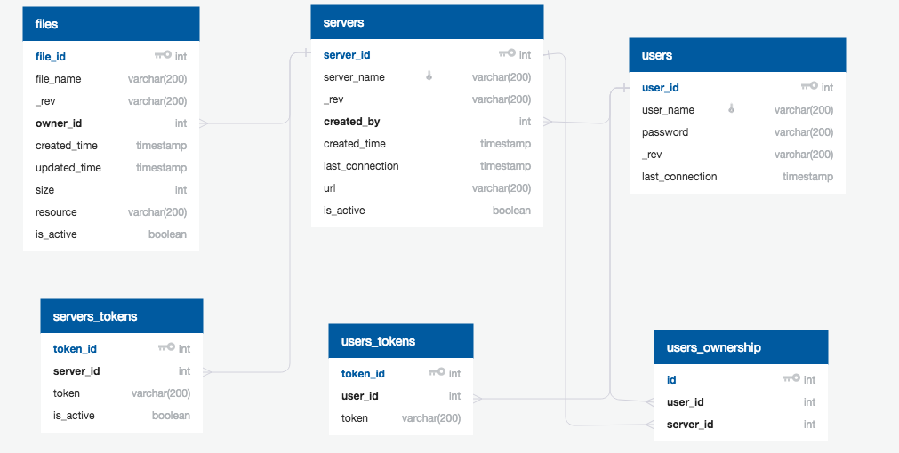

# Shared Server

## Tecnologías involucradas

El Shared Server se desarrolló en Node 8, utilizando Express como librería para el servidor web y PostgreSQL para el manejo de base de datos.

Se eligió Node 8 con la finalidad de tener a disposición la herramienta **async/await** para el manejo del asincronismo.

Utiliza además el servicio de Google Cloud Storage para el almacenamiento de archivos multimedia en la nube.

## Ambientes

El Shared Server se encuentra disponible en dos ambientes:
* Staging: utilizado para correr las pruebas de integración
* Producción: utilizado para el ambiente productivo

A su vez existen base de datos de staging y producción, como asi también buckets de Google Cloud Storage en sus versiones de staging y producción.

Cada ambiente posee un archivo de configuración específico que se encuentra dentro de la carpeta config.

## Arquitectura

### General

Se desarrollaron routers específicos para cada uno de los dominios específicos de la aplicación.

* Usuarios
* Servidores
* Archivos
* Estadísticas

Aprovechando la utilización de Express, la funcionalidad de cada router se dividió en middlewares, de forma tal de poder reutilizar la funcionalidad de un middleware en diferentes endpoints.

### Middlewares

Se configuraron como si fuese un pipeline, donde cada middleware recibe el request, lo procesa y luego pasa el mando al siguente. En caso de error, se pasa inmediatamente al middleware de manejo de errores.

#### Validacion de requests

En todos los casos donde fue posible, se implemento un middleware para validar que el request tenga todos los parametros necesarios para ejecutarse correctamente.

Si el request posee algun tipo de error, se pasa inmediatamente al middleware de manejo de errores con un error 400 (Bad Request).

#### Autenticación

Si el request fue validado correctamente, el control pasa al middleware de autenticación. Existen dos tipos de middleware de autenticación:

* Token: utilizado en la mayoria de los endpoints. Valida que exista un token valido en el Authorization header. El token puede pertenecer a:
    * Servidor
    * Usuario administrador
* Password: utilizado únicamente en los endpoints de solicitud de tokens. Valida que el password enviado en el request sea el mismo con el cual se registró el usuario.

En ambos casos, si la autenticación falla, el middleware devuelve un error 401 (Unauthorized) y pasa el control inmediatamente al middleware de manejo de errores.

#### Servicios generales

Si el request fue validado correctamente y el usuario se autenticó correctamente, se pasa a los middlewares encargados de ejecutar el servicio solicitado. Entre los cuales se encuentran:

* Alta, baja, modificación y consulta de servidores
* Alta, baja, modificación y consulta de archivos
* Alta de usuarios (de aplicación y administradores)
* Alta de tokens para usuarios y servidores
* Validación de tokens para usuarios
* Validación de servidor autorizado para ver archivo
* Actualización de última fecha de conexión para usuarios y servidores

Si por algún motivo, el servicio solicitado no puede terminar su ejecución, se pasa al middleware de manejo de errores con el error correspondiente.

#### Generacion de respuesta

Si todos los middlewares previos se ejecutaron con éxito, se pasa al middleware de generación de respuesta, donde se genera el cuerpo de la respuesta en formato JSON y se envía.

#### Manejo de errores

En el caso de que algún middleware devuelva algún error, el control pasa inmediatamente al middleware de manejo de errores, que recibe un codigo de error y un mensaje, y lo envía como respuesta.

### Base de datos

La base de datos se diseñó en Postgre SQL. Se utilizó la librería 'pg' para el manejo de la misma en Node 8. Asimismo, se implementaron scripts para permitir fácilmente la regeneración y la limpieza de la base de datos.

### Manejo de tokens

El shared server puede manejar tres tipos distintos de tokens:
* Tokens de usuarios:
    * No se utilizan para autenticación en los endpoints.
    * Se incluyen solamente en el body del request del endpoint 'token-check' para validar si el token es correcto.
    * Expiran luego de 1 hora de su creación.
* Tokens de usuarios administradores:
    * Se utilizan para autenticar en aquellos endpoints habilitados para usuarios administradores.
    * Se deben incluir en el Authorization header con el formato _Bearer < token >_
    * Expiran luego de 12 horas de su creación.
* Tokens de servidores:
    * Se utilizan para autenticar en aquellos endpoints habilitados para servidores.
    * Se deben incluir en el Authorization header con el formato _Bearer < token >_
    * No expiran

## Estrategia de testing

El testing del Shared Server se realizó utilizando el framework Mocha.

### Pruebas unitarias

Se desarrollaron pruebas unitarias para la funcionalidad principal del shared server. En todo caso donde un módulo tuviese alguna dependencia externa, se utilizaron las librerías sinon y proxyquire para trabajar con mocks de los servicios en cuestión.

### Pruebas de integración

Para completar y cumplir con el coverage previsto se realizaron pruebas de integración del Shared Server como un todo, es decir, sin utilizar mocks de ningún servicio.

Estos tests utilizan la base de datos de staging, con el objetivo de no contaminar con datos de prueba a la base de datos productiva.

Como existen servicios externos que tambien dependen de esta base de datos, por ejemplo, los tests de integración que existen en el App Server, no se realiza ningún tipo de limpieza luego de su ejecución.
Teniendo esto cuenta, cada test se desarrolló de forma tal de que pueda ejecutarse independientemente del estado de la base de datos, por ejemplo, generando valores aleatorios para nombres de usuario y servidores.

